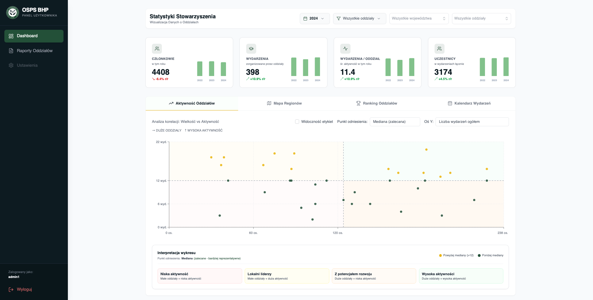
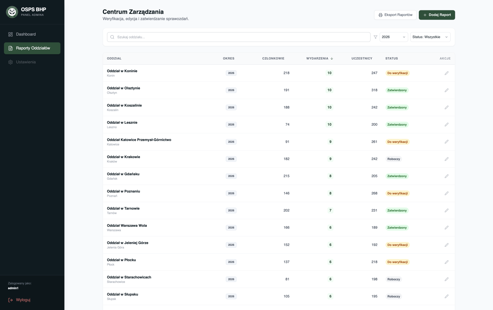

# OSPSBHP - Dashboard and Report Management System

> **Note:** This application is developed for a Polish professional organization (OSPSBHP - Polish Association of OHS Professionals). The user interface and all content are in Polish, as it serves the needs of a Polish association. For Polish documentation, see [README.pl.md](./README.pl.md).

## Description

Web application for managing and visualizing reports from OSPSBHP (https://ospsbhp.pl) branches with an interactive dashboard and PDF document generation. Developed as a personal initiative to serve the association, of which I am a member. Currently in testing stage, premiere presentation scheduled for 16.01.2026.

## Purpose

The system solves the problem of comprehensive management of annual reports from branches of the OSPSBHP organization, enabling:
- Centralized collection and processing of data from all branches
- Visualization of statistics on an interactive map of Poland and charts
- Generation of PDF reports for individual branches and collective report books
- Management of board member data and organized events
- Tracking of report statuses (draft, submitted, approved, rejected)

> **Disclaimer:** The screenshots and dashboard preview below utilize **mock data** for demonstration purposes. No real sensitive information is displayed. The names of OSPS BHP branches are real and publicly available.

## Dashboard Panel

## Admin Panel

## More Screenshots

See more screenshots and the video in the [assets](./assets/) folder. To see the generated PDF file for the Kraków branch, go to [this file](./assets/Raport_2025_Krakow.pdf).

## Tech Stack

**Frontend:**
- React 18
- Vite
- React Router DOM
- Tailwind CSS
- Recharts (charts)
- React Simple Maps (Poland map)
- React PDF Renderer (PDF generation)

**Backend:**
- Node.js
- Express.js
- PostgreSQL
- pg (PostgreSQL client)

**Tools:**
- Lucide React (icons)
- clsx (conditional CSS classes)

